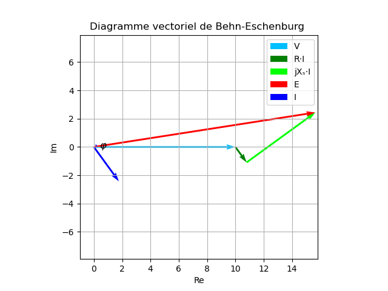

# Behn-Eschenburg
Trace un diagramme de Behn-Eschenburg à partir des valeurs rentrées

Il suffit de renseigner les valeurs au début du fichier python puis de changer les limites d'axes si nécessaire.
